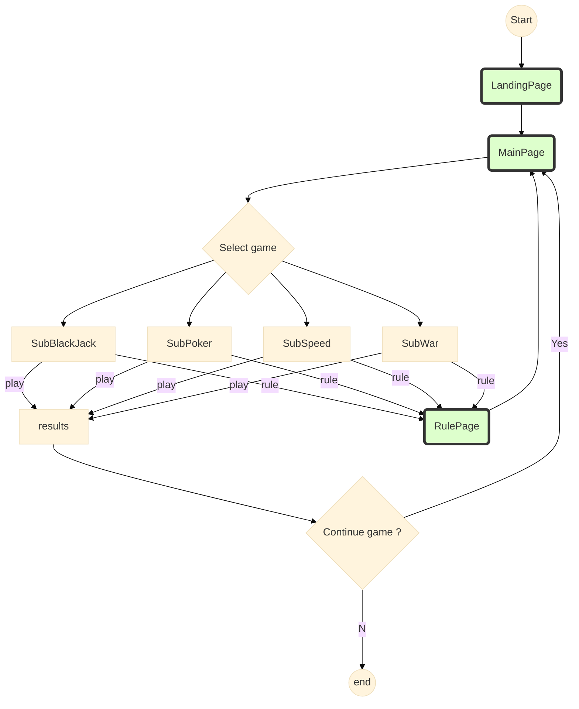
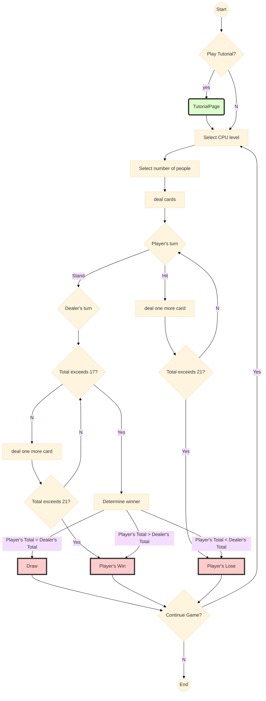

# card-games

## 技術スタックの構成図

## アクティビティ図
Subがついているのはサブアクティビティ

```mermaid
%%{init:{'theme':'base'}}%%
flowchart TB
    A((Start)) --> B(LandingPage)
    style B fill:#dfc,stroke:#333,stroke-width:4px
    B --> C(MainPage)
    style C fill:#dfc,stroke:#333,stroke-width:4px
    C --> D{Select game}
    D --> E[SubBlackJack]
    D --> F[SubPoker]
    D --> G[SubSpeed]
    D --> H[SubWar]
    E --play--> I[results]
    F --play--> I
    G --play--> I
    H --play--> I
    E --rule--> M(RulePage)
    F --rule--> M
    G --rule--> M
    H --rule--> M
    style M fill:#dfc,stroke:#333,stroke-width:4px
    M --> C
    I --> J{Continue game ?}
    J --Yes--> C
    J --No--> K((end))
    
```

## Black Jack
### 検討事項
- チップを賭ける機能の実装をどうするか
- 複数人での対戦機能

```mermaid
%%{init:{'theme':'base'}}%%
flowchart TB
    A((Start)) --> B{Play Tutorial?}
    B --yes--> C(TutorialPage)
    style C fill:#dfc,stroke:#333,stroke-width:4px
    C --> D
    B --No--> D[Select CPU level]
    D --> E[Select number of people]
    E --> F[deal cards]
    F --> G{Player's turn}
    G --Stand--> H{Dealer's turn}
    G --Hit--> I[deal one more card]
    I --> J{Total exceeds 21?}
    J --No--> G
    J --Yes--> K[Player's Lose]
    style K fill:#fcc,stroke:#333,stroke-width:4px
    H --> L{Total exceeds 17?}
    L --Yes--> M[Determine winner]
    L --No--> N[deal one more card]
    N --> O{Total exceeds 21?}
    O --Yes--> P[Player's Win]
    style P fill:#fcc,stroke:#333,stroke-width:4px
    O --No--> L
    M --Player's Total > Dealer's Total--> P
    M --Player's Total = Dealer's Total--> Q[Draw]
    M --Player's Total < Dealer's Total--> K
    style Q fill:#fcc,stroke:#333,stroke-width:4px
    Q --> R{Continue Game?}
    P --> R
    K --> R
    R --Yes--> D
    R --No--> S((End))


```