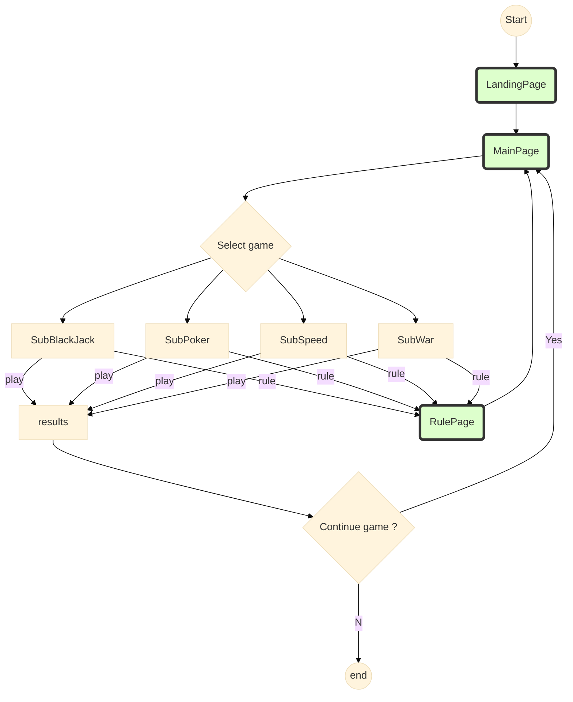
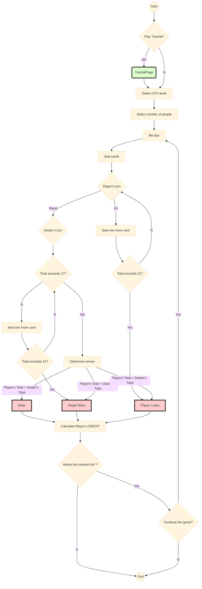
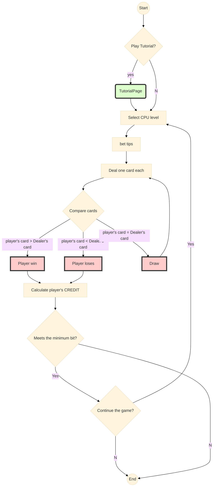
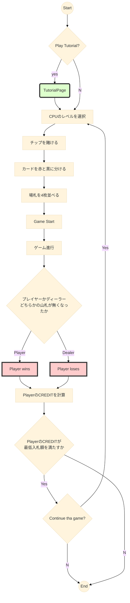
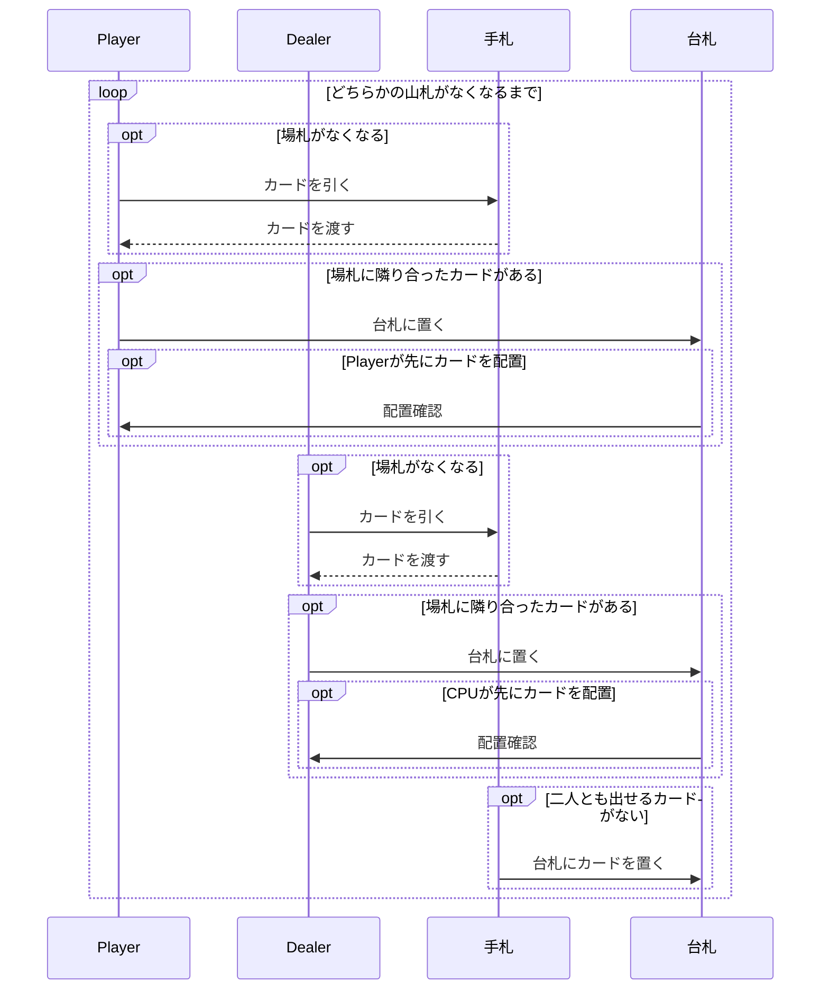
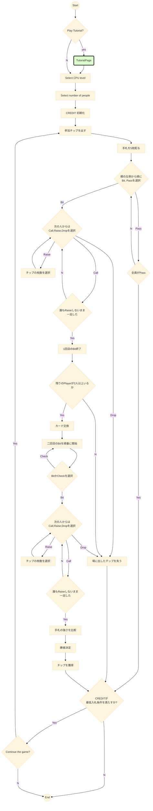

# card-games

## 技術スタックの構成図

## アクティビティ図
Subがついているのはサブアクティビティ

## Black Jack
### 検討事項
- 複数人での対戦機能
- チュートリアルページ
- CPUレベルに応じた処理
- SurrenderやDoubleの追加ルールの実装

## War
### 検討事項
- ルールはディーラーとプレイヤーに一枚ずつ配りカードの強さを比較
- カードの強さはAが最も強く, その他は数字が大きい方が強い
- CPUレベルに応じた処理

## Speed
### 検討事項
- 

ゲーム進行は下記のシーケンス図で示す.

## Poker
### 検討事項
- 

ルールは[任天堂](https://www.nintendo.co.jp/others/playing_cards/howtoplay/poker/index.html)を参照

