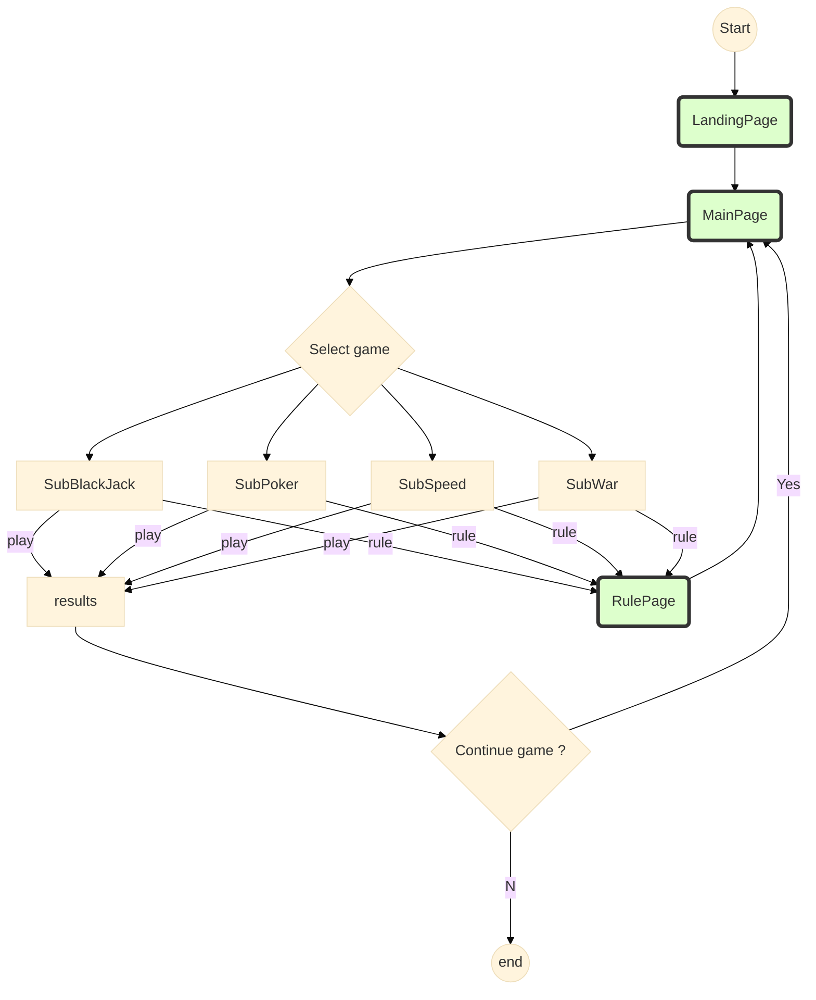
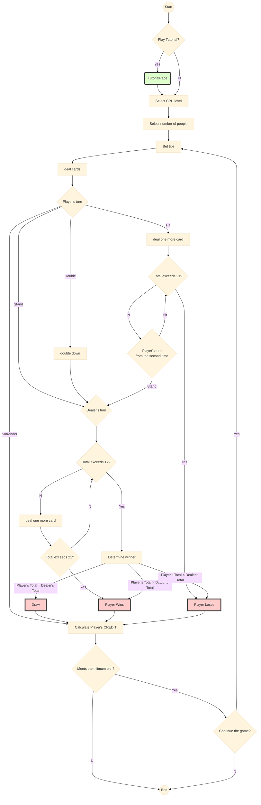
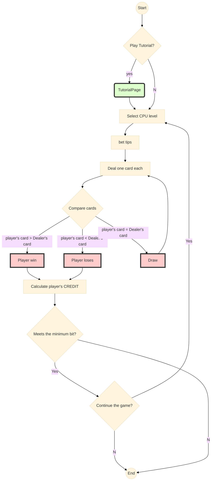
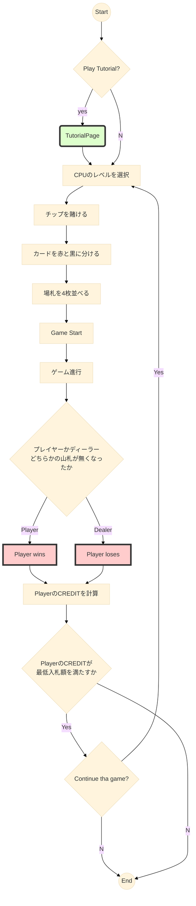
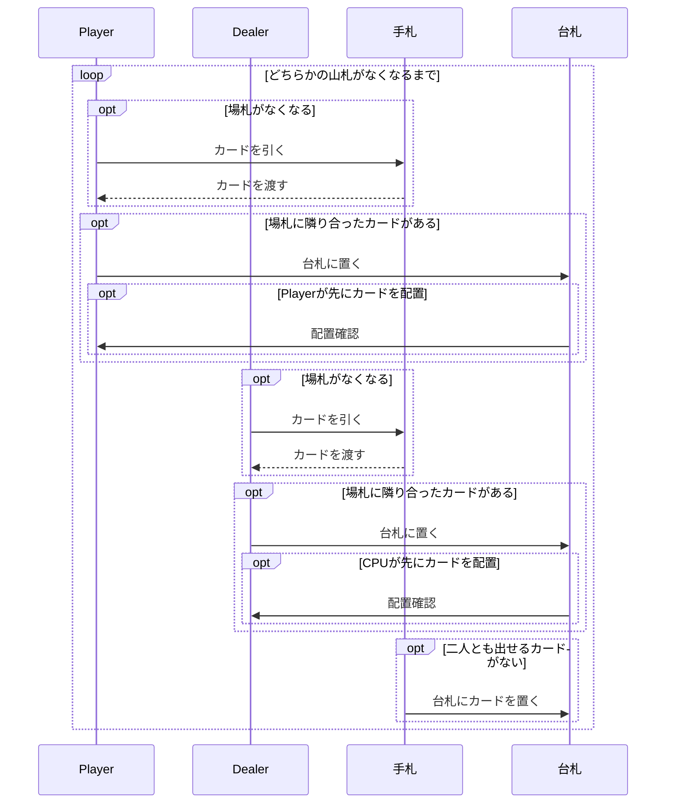
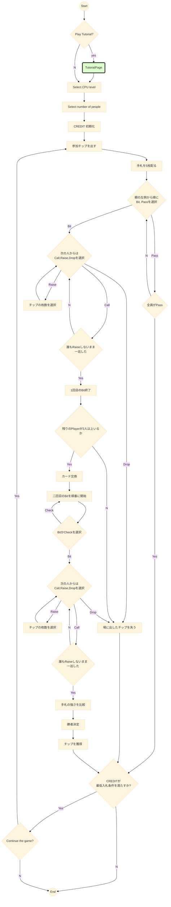
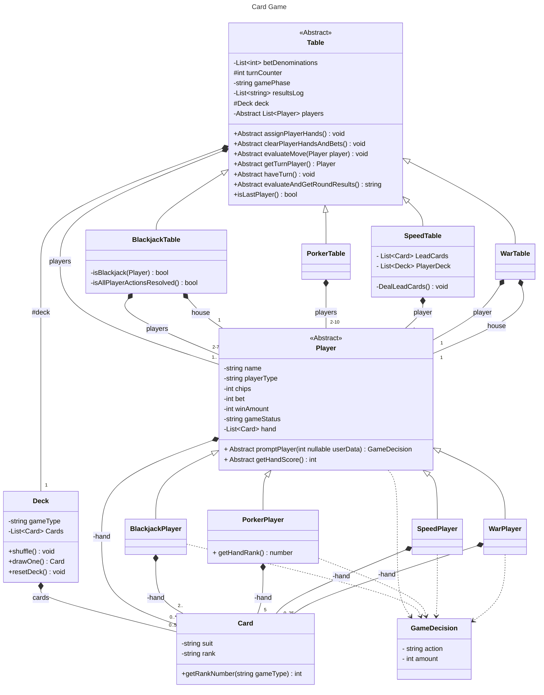

# card-games

## 技術スタックの構成図

## ワイヤーフレーム

## アクティビティ図

Sub がついているのはサブアクティビティ

## Black Jack

### 検討事項

- 複数人での対戦機能
- チュートリアルページ
- CPUレベルに応じた処理(ベーシックストラテジー)
- Surrenderのとき, 掛け金の半額

## War

### 検討事項

- ルールはディーラーとプレイヤーに一枚ずつ配りカードの強さを比較
- カードの強さは A が最も強く, その他は数字が大きい方が強い
- CPU レベルに応じた処理

## Speed

### 検討事項

-

ゲーム進行は下記のシーケンス図で示す.

## Poker

### 検討事項

-

ルールは[任天堂](https://www.nintendo.co.jp/others/playing_cards/howtoplay/poker/index.html)を参照

## クラス図
### 検討事項
- CardクラスはPhaserではアニメーション, 座標等が必要になる可能性あり
- 各ゲームのTableクラスでは, create(), update()で処理を行う必要がある. また, ボタン等の作成が必要.
- 各クラスの変数はゲッター・セッターを使って, 必要に応じてバリデーションをつける方が良いか
- DeckクラスにisEmpty()を追加（Speedで使う？）

## クラスの説明

### Table

|  関数名・変数名  |  説明  |
| :--: | :--: |
|  betDenominations	|  テーブルで可能なベット金額の単位を表す整数の配列.  例えば、[5, 20, 50, 100]など. プレイヤーはこれらの値を組み合わせて任意のベット額を作成することが可能.|
| turnConter | 現在のターン数を表す数値. 0から始まり各ターンが終了するたびにインクリメントされる.  複数人対戦の場合, 現在のプレイヤーを判断するために使用される. |
| gamePhase | ゲームの段階を表す.  ゲームごとに設定するが, Blackjackの場合, {'betting', 'acting', 'evaluatingWinner','roundOver', 'endOfGame'}のどれか. |
|  resultsLog  |  各ラウンド終了時のハウス以外の全プレイヤーの状態を、文字列の配列の形で記録する.  |
| assignPlayerHands() | 各プレイヤーに手札を配る. |
| clearPlayerHandsAndBets() | 各ラウンド開始時に実行され, 各プレイヤーの手札とベットを初期化する. |
| evaluateMove(Player player) |Table.haveTurn()内で呼ぶ関数.  引数のPlayer.promptPlayer()から現在のプレーヤーのgameDecision(ベット方法やアクションなど)を受け取り, それにしたがって、そのプレイヤーのベット、ハンド、GameStatus、チップの状態などを更新する.  例：blackjackでplayerが"hit"し, 手札が21以上のとき, player.gameStatusを'bust'にし,チップからベットを引く. |
| getTurnPlayer() | 現在のターンが誰のものかを返す. evaluateMove()とともに使用する. |
| haveTurn() | ラウンドロビン形式のゲームで、各ターンを管理する役割.   最初に現在のゲームの段階(gamePhase)を確認する.   その後, getTurnPlayer()を用いて現在のプレイヤーを特定し, Player.promptPlayer()を使って, そのプレイヤーに行動を促す.   プレイヤーの行動(gameDecisionオブジェクト)はevaluateMove()によって評価され, プレイヤー・ゲーム状態が更新される.   最後にターン数(turnCounter)を一つ増やす. |
| evaluateAndGetRoundResults() | ラウンド終了時にresultLsLogを更新する関数. 詳細は各ゲームに記載. |
| isLastPlayer() | プレイヤー配列の最後のプレイヤーかチェックする関数.   haveTurnで使用されゲームの段階を切り替える(gamePhase='betting'→'acting'). |

### BlackJackTable

| 関数名・変数名 | 説明 |
| :--: | :--: |
| evaluateAndGetRoundResults() | すべてのプレイヤーのアクションが終わり,  現在のプレイヤーがプレイヤーの配列の最後のプレイヤーである場合に呼び出される. このメソッドは、ブラックジャックの勝敗判定ルールに従ってプレイヤーを更新し,  ラウンドが終了してテーブルがクリアされる前の各プレイヤーの状態を表す文字列を返す.  この返された文字列は、Table.resultsLogに追加される.   gameStatusが'bust'となっているプレイヤーなど,  既にラウンドが決定しているプレイヤーは一切更新されない。 |
| isBlackjack(Player) | プレイヤーの手札がブラックジャック(21ちょうど)かどうかを判定する. |
| isAllPlayerActionsResolved() | 全てのプレイヤーがセット{'broken', 'bust', 'stand'}の Player.gameStatusを持っていればtrueを返し,持っていなければfalseを返す.  ハウスを含むプレイヤーは何度も'hit'し続ける可能性があるので,  'acting'フェーズがいつ終わるか把握する必要がある。 |

### Speedtable

| 関数名・変数名 | 説明 |
| :--: | :--: |
| LeadCards | 台札2枚 |
| PlayerDeck | プレイヤーとhouseの山札を管理するリスト. |
| DealLeadCards() | ゲームの初めや一定時間経過後に, 台札にカードを置く.  山札がない場合は手札からだす.|

### Player
| 関数名・変数名 | 説明 |
| :--: | :--: |
| playerType | プレイヤーの種類を表す. 例：AI, house, user|
| chips | 所持しているチップの数 |
| bet | 現在のゲームに賭けたチップの数 |
| winAmount | 各ラウンド終了時の勝ち負け金額を表す.   chipsと同様に処理を行うが各ラウンドの結果表示の際に用いられる. |
| gameStatus | プレイヤーの状態を表す. 詳細は各ゲームを参照. |
| hand | playerの手札 |
| promtPlayer() | TableのgamePhaseとPlayerのplayerTypeに応じて,  各Playerが取る行動をGameDecisionクラスのオブジェクトとして返す. |
| getHandScore() | 手札の合計値をゲームの種類に合わせて計算. CardクラスのgetRankNumberメソッドを用いる. | 

### BlackjackPlayer

| 関数名・変数名 | 説明 |
| :--: | :--: |
| gameStatus | プレイヤーの状態を表す. {'ready', 'bet', 'stand', 'hit', 'bust'}のどれか。 |

### PokerPlayer

| 関数名・変数名 | 説明 |
| :--: | :--: |
| getHandRank() | 手札の役の強さを判定する. |

### GameDecision

| 関数名・変数名 | 説明 |
| :--: | :--: |
| action | 各ゲームで取りうるアクション.  -Blackjack: {'bust', 'bet', 'stand', 'hit', 'blackjack'}   -Porker: {'bet', 'check', 'call', 'raise', 'drop', 'draw'} -Speed: {} -War: {}|
| amount | betのアクションがあるゲームでは、bet金額. |

### Deck
| 関数名・変数名 | 説明 |
| :--: | :--: |
| shuffle() | gameTypeごとに必要になるCardを格納した, 配列をランダムにシャッフルする関数. |
| drawOne() | Cardの配列からpopして先頭1枚のCardを取り出す関数. |
| resetDeck() | gameTypeごとに適したCardを格納した配列を初期化する関数. |

### Card
| 関数名・変数名 | 説明 |
| :--: | :--: |
| suit | カードの種類(ダイヤ・スペード・クローバー・ハート) |
| rank | カードの数字(A,2,3,...Q,K) |
| getRankNumber(string gameType) | gemeType(ゲームの種類)を受け取り, カードのrankを数字にして返す関数.   例えば, Blackjackの場合, rankがJ,Q,Kのとき, 整数10を返す. |