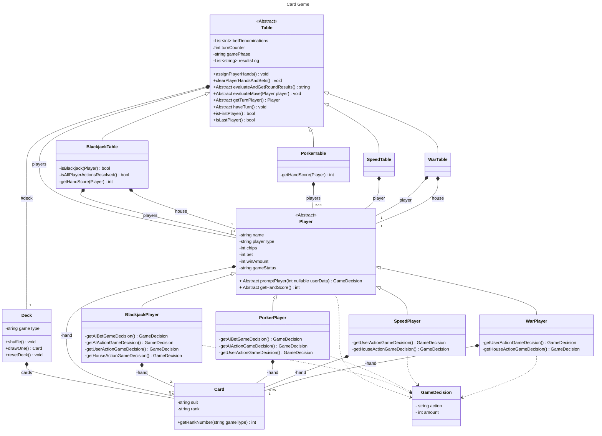

# card-games

## 技術スタックの構成図

## アクティビティ図
Subがついているのはサブアクティビティ

## Black Jack
### 検討事項
- 複数人での対戦機能
- チュートリアルページ
- CPUレベルに応じた処理
- SurrenderやDoubleの追加ルールの実装

## War
### 検討事項
- ルールはディーラーとプレイヤーに一枚ずつ配りカードの強さを比較
- カードの強さはAが最も強く, その他は数字が大きい方が強い
- CPUレベルに応じた処理

## Speed
### 検討事項
- 

ゲーム進行は下記のシーケンス図で示す.

## Poker
### 検討事項
- 

ルールは[任天堂](https://www.nintendo.co.jp/others/playing_cards/howtoplay/poker/index.html)を参照

## クラス図

## クラスの説明

### Table

|  関数名・変数名  |  説明  |
| :--: | :--: |
|  betDenominations	|  テーブルで可能なベット金額の単位を表す整数の配列.  例えば、[5, 20, 50, 100]など. |
|  resultLog  |  	各ラウンド終了時のハウス以外の全プレイヤーの状態を、文字列の配列の形で記録する.  |
| turnConter | ラウンドロビン形式のゲームで現在ターンのプレイヤーを識別するためのカウンター |
| evaluateMove() |Table.haveTurn()内で呼ぶ関数.  Player.promptPlayer()から現在のプレーヤーのgameDecision(ベット方法やアクションなど)を受け取り, それにしたがって、そのプレイヤーのベット、ハンド、GameStatus、チップの状態などを更新する |
| haveTurn() | ラウンドロビン形式のゲームで、ゲームフローの制御とテーブルの状態を更新する |

### BlackJackTable

| 関数名・変数名 | 説明 |
| :--: | :--: |
| gamePhase | ゲームの段階を表す. {'betting', 'acting', 'roundOver', 'endOfGame'}のどれか. |
| assignPlayerHands() | 各プレイヤーにカードを2枚ずつ配布する. |
| evaluateAndGetRoundResults() | すべてのプレイヤーのアクションが終わり,  現在のプレイヤーがプレイヤーの配列の最後のプレイヤーである場合に呼び出される. このメソッドは、ブラックジャックの勝敗判定ルールに従ってプレイヤーを更新し,  ラウンドが終了してテーブルがクリアされる前の各プレイヤーの状態を表す文字列を返す.  この返された文字列は、Table.resultsLogに追加される.   gameStatusが'bust'となっているプレイヤーなど,  既にラウンドが決定しているプレイヤーは一切更新されない。 |
| isAllPlayerActionsResolved() | 全てのプレイヤーがセット{'broken', 'bust', 'stand'}の Player.gameStatusを持っていればtrueを返し,持っていなければfalseを返す.  ハウスを含むプレイヤーは何度も'hit'し続ける可能性があるので,  'acting'フェーズがいつ終わるか把握する必要がある。 |

### Player
| 関数名・変数名 | 説明 |
| :--: | :--: |
| promtPlayer() | TableのgamePhaseとPlayerのplayerTypeに応じて,  各Playerが取る行動をGameDecisionクラスのオブジェクトとして返す. |

### BlackjackPlayer

| 関数名・変数名 | 説明 |
| :--: | :--: |
| gameStatus | プレイヤーの状態を表す. {'ready', 'bet', 'stand', 'hit', 'bust'}のどれか。 |
| getAIBetGameDecision() | Table.promptPlayer()内で呼ぶ関数.  AIのベット金額を決める.  所持金からベット可能な金額をランダムに決定する. |
| getAIActionGameDecision() | Table.promptPlayer()内で呼ぶ関数. AIのアクションを決める.  所持金を考慮し、{'hit', 'stand'}の候補からアクションをランダムに決定する. |
| getUserActionGameDecision() | Table.promptPlayer()内で呼ぶ関数.  Userのアクションを決める.  所持金を考慮し、{'hit', 'stand'}の候補からアクションを決定する.  bustしない限り、hitは何度でもできる. |
| getHouseActionGameDecision() | Table.promptPlayer()内で呼ぶ関数.  Houseのアクションを決める. 持ち札のスコアが17未満であれば、17以上になるまで、Hitを続ける |

### GameDecision

| 関数名・変数名 | 説明 |
| :--: | :--: |
| action | 各ゲームで取りうるアクション.  -Blackjack: {'bust', 'bet', 'stand', 'hit', 'blackjack'}   -Porker: {'bet', 'check', 'call', 'raise', 'drop', 'draw'} -Speed: {} -War: {}|
| userData | betのアクションがあるゲームでは、bet金額. |

